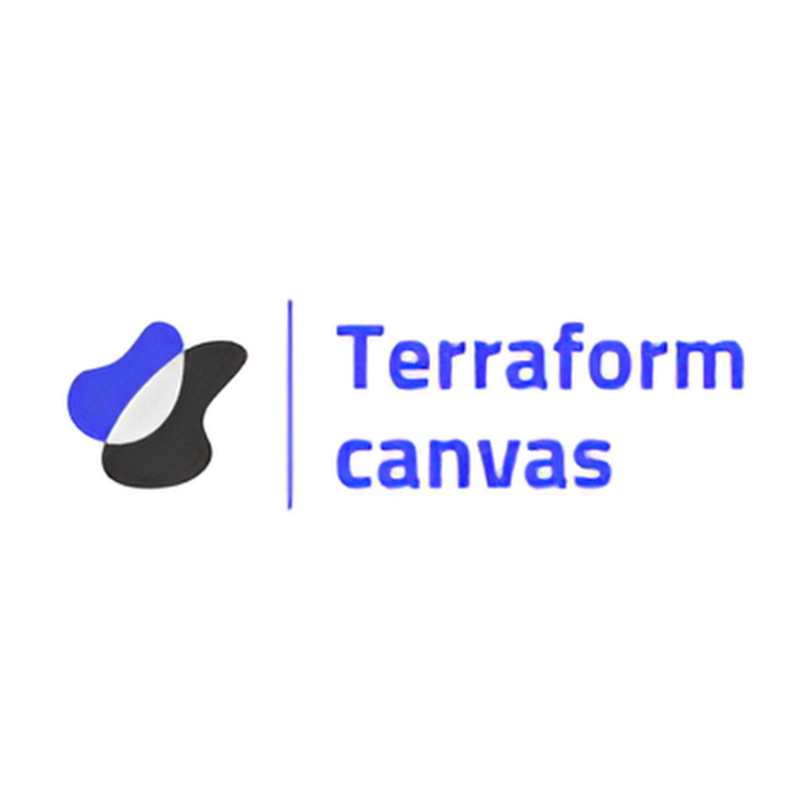

<!-- Improved compatibility of back to top link: See: https://github.com/othneildrew/Best-README-Template/pull/73 -->
<a name="readme-top"></a>
[![Contributors][contributors-shield]][contributors-url] [![Forks][forks-shield]][forks-url] [![Stargazers][stars-shield]][stars-url] [![Issues][issues-shield]][issues-url] [![Pull Request][pr-shield]][pr-url] [![MIT License][license-shield]][license-url]


<!-- PROJECT LOGO -->
<br />
<div align="center">
  <a href="https://github.com/Terraform-Canvas/canvas-helm">
    
  </a>

<h3 align="center">Terraform-Canvas</h3>

  <p align="center">
    Terraform Cloud Infrastructure Provisioning Web Services Project with Visual Programming
    <br />
    <a href="https://facerain.notion.site/e393c21c423e46318f1dd21a3a9ed428?v=cf7ba34920154548a7d0303f27c7710b&pvs=4"><strong>Explore the docs »</strong></a>
    <br />
    <br />
    <a href="https://github.com/Terraform-Canvas/canvas-helm/blob/main/README_kor.md">한국어</a>
    ·
    <a href="https://github.com/Terraform-Canvas/canvas-helm/blob/main/README.md">English</a>
    <br />
    <br />
    <a href="https://github.com/Terraform-Canvas/canvas-helm/issues">Report Issues</a>
    ·
    <a href="https://github.com/Terraform-Canvas/canvas-helm/pulls">Pull Requests</a>
  </p>
</div>


<!-- TABLE OF CONTENTS -->
<details>
  <summary>Table of Contents</summary>
  <ol>
    <li>
      <a href="#mag-about-the-project">About The Project</a>
      <ul>
        <li><a href="#card_file_box-built-with">Built With</a></li>
      </ul>
    </li>
    <li>
      <a href="#rocket-getting-started">Getting Started</a>
      <ul>
        <li><a href="#zap-installation">Installation</a></li>
        <li><a href="#pencil2-configuration">Configuration</a></li>
        <li><a href="#triangular_flag_on_post-release">Release</a></li>
      </ul>
    </li>
    <li><a href="#fire-contributing">Contributing</a></li>
    <li><a href="closed_lock_with_key-license">License</a></li>
    <li><a href="#speech_balloon-contact">Contact</a></li>
  </ol>
</details>


<!-- ABOUT THE PROJECT -->
## :mag: About The Project
Many companies are choosing Terraform as an IaC tool for transitioning from existing cloud and on-premise environments to cloud native environments. However, they are suffering a lot due to Terraform's high entry barriers. Therefore, we want to lower the barriers to Terraform's entry through "Terraform Cloud Infrastructure Provisioning Web Service with Visual Programming." This enables start-up and SI teams that want to introduce a new cloud-native environment and TF teams that want to test and prototype the IaC environment quickly.

<p align="right">(<a href="#readme-top">back to top</a>)</p>


### :card_file_box: Built With
#### :bulb: Infrastructure
[![Kubernetes][Kubernetes]][Kubernetes-url] [![OCI][OCI]][OCI-url]
#### :bulb: Environment (CI/CD, Package tools...)
[![Github-actions][Github-actions]][Github-actions-url] [![Helm][Helm]][Helm-url] [![Accordian][Accordian]][Accordian-url]

<p align="right">(<a href="#readme-top">back to top</a>)</p>


<!-- GETTING STARTED -->
## :rocket: Getting Started

### :zap: Installation
```bash
helm repo add canvas-helm https://terraform-canvas.github.io/canvas-helm/

helm install canvas-helm/terraform-canvas
```

### :pencil2: Configuration
It needs github token to run release workflow.
```bash
## Github Repository settings
TOKEN_GITHUB=xxx
```

### :triangular_flag_on_post: Release
You have to follow next steps to release your helm chart
1. Fix version in `/charts/terraform-canvas/Chart.yaml`
2. Make Pull Request from release branch to main branch
3. Merge above Pull Request (Then, the release workflow runs, and it makes release package)


<p align="right">(<a href="#readme-top">back to top</a>)</p>


<!-- CONTRIBUTING -->
## :fire: Contributing
Please refer to `CONTRIBUTION.txt` for Contribution.

For issues, new functions and requests to modify please follow the following procedure. 🥰

1. Fork the Project
2. Create a Issue when you have new feature or bug, just not Typo fix
3. Create your Feature Branch from dev Branch (`git checkout -b feature/Newfeature`)
4. Commit your Changes (`git commit -m 'feat: add new feature'`)
5. Push to the Branch (`git push origin feature/Newfeature`)
6. Open a Pull Request to dev branch with Issues

<p align="right">(<a href="#readme-top">back to top</a>)</p>


<!-- LICENSE -->
## :closed_lock_with_key: License
Please refer to `LICENSE.txt` for LICENSE.
<p align="right">(<a href="#readme-top">back to top</a>)</p>


<!-- CONTACT -->
## :speech_balloon: Contact

<table>
  <tbody>
    <tr>
      <td align="center"><a href="https://github.com/Eeap"><br /><sub><b>Sumin Kim</b></sub></a></td>
    </tr>
  </tobdy>
</table>

<p align="right">(<a href="#readme-top">back to top</a>)</p>


<!-- MARKDOWN LINKS & IMAGES -->
<!-- https://www.markdownguide.org/basic-syntax/#reference-style-links -->
[contributors-shield]: https://img.shields.io/github/contributors/Terraform-Canvas/canvas-helm.svg?style=flat
[contributors-url]: https://github.com/Terraform-Canvas/canvas-helm/graphs/contributors
[forks-shield]: https://img.shields.io/github/forks/Terraform-Canvas/canvas-helm.svg?style=flat
[forks-url]: https://github.com/Terraform-Canvas/canvas-helm/network/members
[stars-shield]: https://img.shields.io/github/stars/Terraform-Canvas/canvas-helm.svg?style=flat
[stars-url]: https://github.com/Terraform-Canvas/canvas-helm/stargazers
[issues-shield]: https://img.shields.io/github/issues/Terraform-Canvas/canvas-helm.svg?style=flat
[issues-url]: https://github.com/Terraform-Canvas/canvas-helm/issues
[pr-url]: https://github.com/Terraform-Canvas/canvas-helm/pulls
[pr-shield]: https://img.shields.io/github/issues-pr/Terraform-Canvas/canvas-helm.svg?style=flat
[license-shield]: https://img.shields.io/github/license/Terraform-Canvas/canvas-helm.svg?style=flat
[license-url]: https://github.com/Terraform-Canvas/canvas-helm/blob/master/LICENSE.txt

[OCI]: https://img.shields.io/badge/Oracle-F80000?style=flat&logo=oracle&logoColor=black
[OCI-url]: https://www.oracle.com/kr/cloud/
[Kubernetes]: https://img.shields.io/badge/Kubernetes-326CE5?style=flat&logo=Kubernetes&logoColor=white
[Kubernetes-url]: https://kubernetes.io/ko/
[Github-actions]: https://img.shields.io/badge/GitHub_Actions-2088FF?style=flat&logo=github-actions&logoColor=white
[Github-actions-url]: https://github.com/features/actions
[Helm]: https://img.shields.io/badge/Helm-326CE5?style=flat&logo=Helm&logoColor=white
[Helm-url]: https://helm.sh/
[Accordian]: https://img.shields.io/badge/Accordian-430098?style=flat&logo=Accordian&logoColor=white
[Accordian-url]: https://accordions.co.kr/
